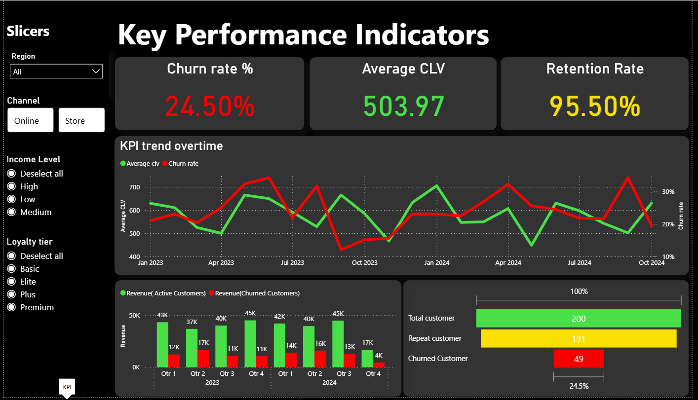
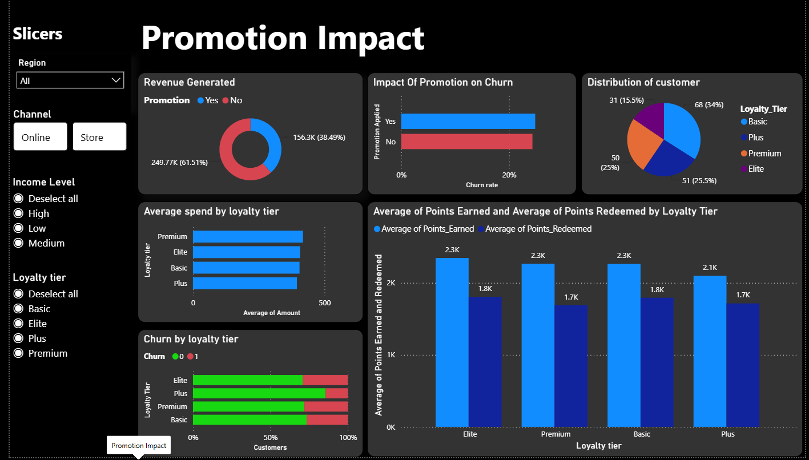
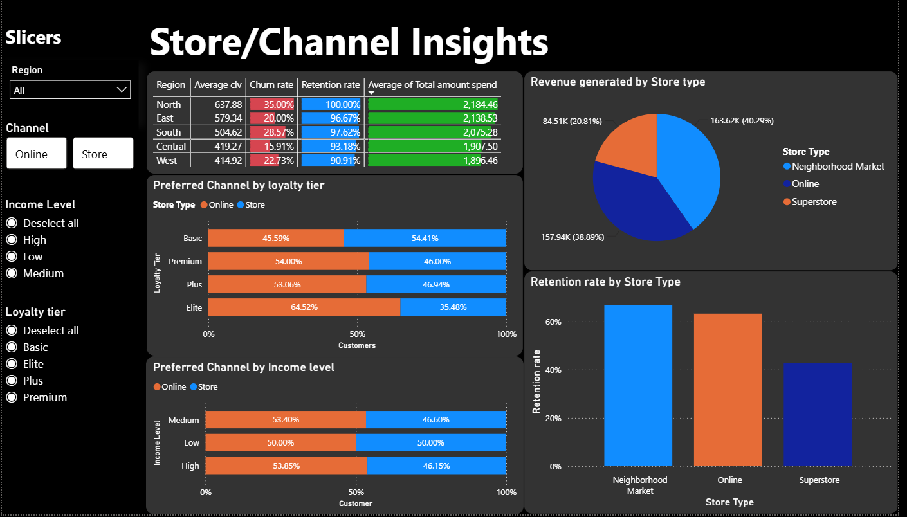
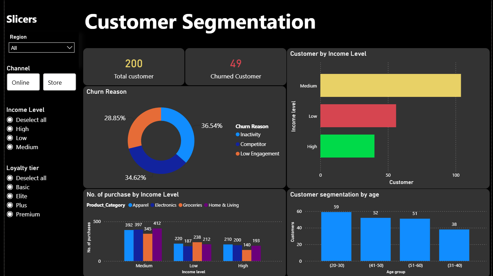

# Retail Customer Retention Analytics - Target
**A Power BI Data Analysis Project by Siddhesh Khanderao Dandekar**

##  Project Overview
This data analytics project leverages Power BI to analyze customer retention and churn for a retail business (Target). The dashboard features end-to-end data modeling, advanced DAX calculations for Customer Lifetime Value (CLV) and churn rates, and detailed customer segmentation. By evaluating store channels, loyalty tiers, and promotional impacts, the project delivers data-driven recommendations to optimize the loyalty program and increase overall retention.

** Watch the Full Video Presentation Here:** [Project Walkthrough & Insights](https://drive.google.com/file/d/1Lm1tPM6v7y-yDYNrnZMv8PNMbiDMZ9_d/view?usp=sharing)

---

##  Dashboard Previews

| Key Performance Indicators | Promotion Impact |
| :---: | :---: |
|  |  |
| **Store & Channel Insights** | **Customer Segmentation** |
|  |  |

---

## Tech Stack & Tools
* **Business Intelligence:** Power BI
* **Data Transformation:** Power Query
* **Calculations:** DAX (Data Analysis Expressions)
* **Data Modeling:** Star Schema

---

## Data Modeling & Preparation
The dataset was loaded and transformed using Power Query. A Star Schema was built to connect the following tables:
* **Fact Table:** `Customer_Transactions`
* **Dimension Tables:** `Customer_Demographics`, `Loyalty_Program`, `Store_Locations`, and `Churn_Labelled_Customers`.

Calculated columns and DAX measures were created to extract deeper insights, including:
* **Membership Duration:** Calculated from the `Membership_Since` date using the `DATEDIFF` function.
* **Customer Lifetime Value (CLV):** Total amount spent divided by membership duration.
* **Retention & Churn Rates:** Tracked customer lifecycle flow (Total Customers → Repeat Customers → Churned Customers) using `DISTINCTCOUNT` and division logic.

---

## Key Insights & Findings

### 1. Loyalty Program Inefficiencies
Elite tier customers earn and spend points at a rate similar to Basic and Premium customers, indicating that the highest-value tier is not being adequately rewarded. Additionally, customers who apply promotional discounts surprisingly show a higher tendency to churn.

### 2. Channel Performance
Superstores are currently underperforming, generating the lowest revenue and demonstrating the lowest retention rates. Conversely, Neighborhood Markets and Online channels boast the highest retention and revenue. Notably, online shopping is the preferred channel for high-value, high-income customers.

### 3. Customer Churn Factors
Growth is currently stagnant due to a high churn rate (24.50%). The primary reasons for churn are "Inactivity", "Low Engagement", and "Competitors". Data shows a direct inverse correlation: as average CLV rises, the churn rate decreases. 

---

## Strategic Recommendations
Based on the data analysis, the following strategies are recommended for Target to reduce churn and increase CLV:

1. **Revamp the Elite Loyalty Tier:** Allocate more points and exclusive perks (e.g., "first try-on" events or exclusive product access) to Elite tier customers to incentivize retention among the highest-value demographic. Reduce the amount of points for basic tier customers.
2. **Shift Focus to High-Performing Channels:** Pivot expansion and operational focus toward Online and Neighborhood Markets, which carry lower upfront costs and yield higher retention. Make the online channels more accessible and user-friendly, as they are preferred by premium customers.
3. **Targeted Re-engagement Campaigns:** Combat competitor-driven churn and low engagement by running targeted online campaigns aimed at medium-to-high income brackets within the 20-30 age group. Focus these campaigns on specific high-performing product categories.

---

## Project Artifacts
* **Approach Sheet:** Step-by-step logic and documentation of the analysis process.
* **Dashboard:** Interactive Power BI Dashboard (`.pbix` file).
